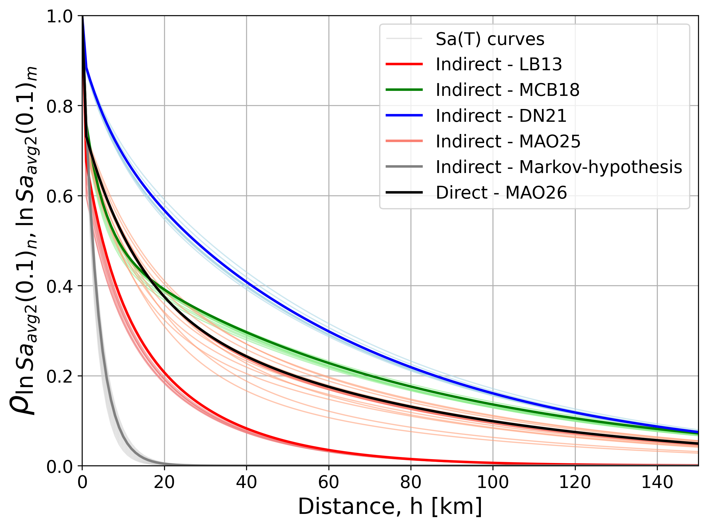

# An indirect approach to calculate spatial correlation of AvgSa(T)
This repository contains scripts that implement an indirect approach for calculating the spatial correlation of AvgSa(T).
It includes tools for comparing results obtained using different inter-Sa(T) spatial correlation models, such as Loth and Baker (2013), Markhvida et al. (2018), Du and Ning (2021), Monteiro et al. (2026) and a Markov-hypothesis-based model.
Additionally, the repository provides comparisons between the indirect and direct formulations of spatial correlation modelling for AvgSa(T), as well as analyeses using within-event and total-residual components.

For more detail please see:
# Reference
Monteiro, V.A, and O’Reilly, G.J. (2026) ‘Notes on spatial correlation for average spectral acceleration: direct and indirect approaches’, (under review)

# How to use
### Define which residual-type you want and select the period T for AvgSa(T). See main.py

```python
#-------------- Indirect approach of spatial-corr for AvgSa(T) with within-event residuals --------------# 
def main_within():
    im = 'Saavg2' # could be 'Saavg2' or 'Saavg3
    base_path = Path(__file__).parent
    data_path = base_path / "data" / "Database.csv"
    predicted_dir = base_path / "outputs_within" / "predicted_files"
    stdev_dir = base_path / "outputs_within" / "stdev_comb"
    corr_output_dir = base_path / "outputs_within" / f"WithinCorr_{im}_ind"


    avgsa_periods = [0.1, 1.0] 
    # add the periods that you want, but be aware of the GMM period limits!

    print("\n=== STEP 1: GMM PREDICTIONS ===")
    compute_gmm_predictions(im, data_path, predicted_dir, avgsa_periods)

    print("\n=== STEP 2: STDEV COMBINATIONS & CORRELATIONS ===")
    process_stdev_combinations(predicted_dir, stdev_dir, avgsa_periods)
    compute_correlations(stdev_dir, avgsa_periods)
    compute_numerators(stdev_dir, avgsa_periods)
    compute_denominators(stdev_dir, avgsa_periods)

    print("\n=== STEP 3: FINAL CORRELATIONS ===")
    compute_final_corr(stdev_dir, corr_output_dir, avgsa_periods)

    print("\nAll processing complete!")
    
#-------------- Indirect approach of spatial-corr for AvgSa(T) with total-event residuals --------------#
def main_total():
    im = 'Saavg2' # could be 'Saavg2' or 'Saavg3
    base_path = Path(__file__).parent
    data_path = base_path / "data" / "Database.csv"
    predicted_dir = base_path / "outputs_total" / "predicted_files"
    stdev_dir = base_path / "outputs_total" / "stdev_comb"
    corr_output_dir = base_path / "outputs_total" / f"TotalCorr_{im}_ind"


    avgsa_periods = [1.0] 
    # add the periods that you want, but be aware of the GMM period limits!

    print("\n=== STEP 1: GMM PREDICTIONS ===")
    compute_gmm_predictions(im, data_path, predicted_dir, avgsa_periods)

    print("\n=== STEP 2: STDEV COMBINATIONS & CORRELATIONS ===")
    process_stdev_combinations_total(predicted_dir, stdev_dir, avgsa_periods)
    compute_correlations_total(stdev_dir, avgsa_periods)
    compute_numerators_total(stdev_dir, avgsa_periods)
    compute_denominators_total(stdev_dir, avgsa_periods)

    print("\n=== STEP 3: FINAL CORRELATIONS ===")
    compute_final_corr_total(stdev_dir, corr_output_dir, avgsa_periods)

    print("\nAll processing complete!")


if __name__ == "__main__":
    main_total()

```

### Check the example comparison of indirect approach for two specific periods of AvgSa(T), (T=0.1s and T=1.0s) using within-event residuals. See example1.py



### Check the example comparison between using within-event residuals and total residuals for AvgSa(T=1.0s). See example2.py

